# Frameworks Exam 1

## Week 1

### Getting Started 
--- 
#### Instructions:
- Angular is not like a standalone language and needs some prerequisites in order to run correctly 
- Node.js and NPM (node package manager) need to be installed 
- Angular uses NPM for package managment 

#### Installing angular cli 
- npm install -g @angular/cli

##### Create a Project 
- ng new learning-angular

##### Run first command
- cd in the project and npm start (visit http://localhost:4200)

### Angular 
--- 
There are a lot of packages automatically installed

#### important ones 
- Package.json 
- Tsconfig.json 
   - In tsconfig it is reccomneded to change "compileOnSave" to true 
### app.component.ts 
--- 
- @component aka a decorator 
    - the decorator will give info about the component 
- pointing at some selector called `app-root` 
- In this case it tells angular how this component will be used with the selector 
    - `app-root` is a tag name for this component that hold pointers to the `HTML & CSS` files are stored
```
@Component({
  selector: 'app-root',
  standalone: true,
  imports: [RouterOutlet, NgForOf, ContentListComponent, ContentListItemComponent],
  templateUrl: './app.component.html',
  styleUrl: './app.component.css'
})
```

### index.html 
```
<app-root></app-root>
```
- This is how it knows this is where it is going to generate the template to inject that right there on line 11  
`this tag repersents a key idea behind building templates, Angular allows use to define our own tags which can be used as another type of placeholder in an HTML file.`

### HTML saftey
- Angular data interpolation using handlebars tries it's very best to be safe
    - it does `NOT` allow HTML injection easily 
        ``` 
        title =  "<h1> Hello world! </h1>";
        ```
    This would display as `<h1> Hello world! </h1>` being printed to the screen

- We can get around this by a slighlty different way of displaying data
    ``` 
    Welcome to <span [innerHtml] = "title" ></span>!
    ```
    Now we can add HTML to our data in the TS file    
    - This method leverages the innerHtml property that span tags have 
This is another way to do `on-way data binding`

### SCSS vs CSS 

<strong>Syntax</strong>: Css follows a plain-text syntax, SCSS follows a more structured syntax  which allows us to use things like variables and nest and mixins.

<strong>Variable</strong>: SCSS allows you to define vars to store commonly use values such as colours, font sizes and spacing

<strong>Nesting</strong>: SCSS allows you to nest selectors within other selectors, making it easier to write and read complex stylesheets

<strong>Mixins</strong>: SCSS allows you to create reusable code snippets using mixins, which are like funcs in programming languages 

<strong>File Extensions</strong>: CSS.css SCSS.scss

<strong>Compilation</strong>: CSS files are interpreted by the web browser, SCSS file s must be preprocessed into standard CSS file using a preprocessor such as Sass 

### Refernces 
https://angular.io/

https://www.typescriptlang.org/docs/handbook/typescript-in-5-minutes.html


## Week 2 

### What is TypeScript?
--- 
- TypeScript is a strongly typed programming language that builds on JavaScript
- TypeScripts adds additional syntax to JavaScript to support a tighter integration with your editor 
- TypeScript code converts to JavaScript, which runs anywhere JavaScript runs: In a browser, on Node.js or Deno and in your apps 
- TypeScript understands JavaScript and uses type inference to give you great tooling without additional code 

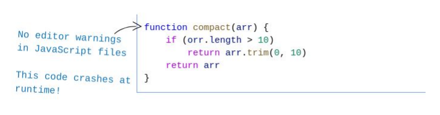
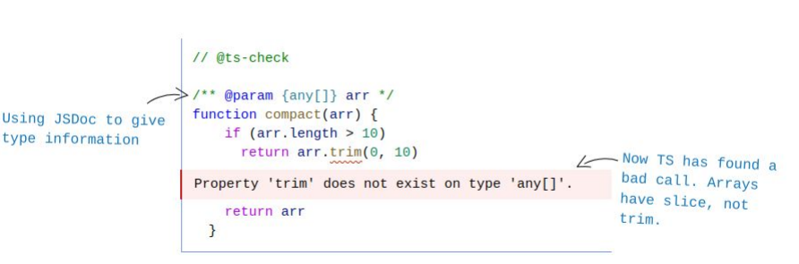
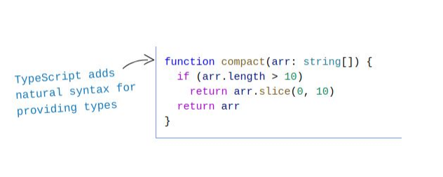

### TypeScript 
---
- Since TS is type safe, you `CANNOT` change the type of this dynamically like you can in JS 
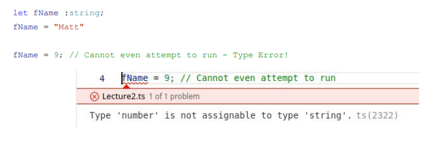

- Vars can still get there type implicitly (unfortunately)
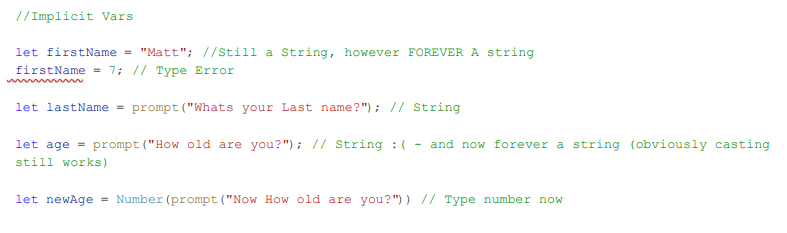

### Default Types 
---
- number - integer and decimal number values 
- boolean - true or false , 0 and 1 are not valid 
- string  - any sequence of characters 
- void - usually used to describe the type of method when it has no return 
- any - this is what you can use to describe the type of any variable or method 
    - ex. it can desctibe a primitive we've outlined above or it can be an object 

### Interfaces 
- These allow us to make custom types, that would otherwise be nameless obj
- We can generate them with the following command using a schema built into TS 
``` 
ng generate interface models/IContent
```
- This is only an option if you can run ng commands in the terminal directly 
- In JS, the fundamental wat that we group and pass around data is through objs. In TS, we repersent those through obj types. 
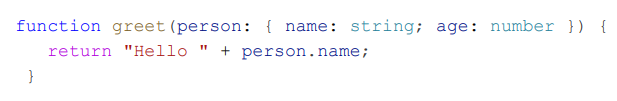
    - or they can be named by using either an interface: 
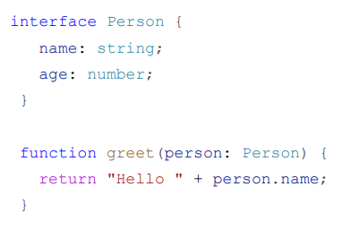
    - or a type alias :  
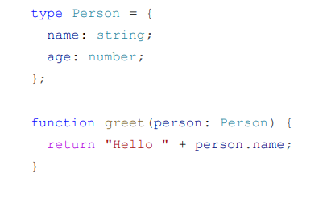
- All 3 examples above, we've written functions that take objects that contain the property name(string) and age(number)

#### TS Type Cheat Sheet 
https://www.typescriptlang.org/cheatsheets\

### Adding it to our package.json 
--- 
We could also add the generate interface command to our list of scripts in the package.json, to make it runnable through npm 
``` 
"generateInteface" : "ng generate interface"
```
Now we can run it in the terminal 
```
npm run-script generateInterface models/IContent
```

### The Resulting IContent Interface 
---
- It will generate an exported <i>Interface</i> of that same name
- We can add properties to the interface   
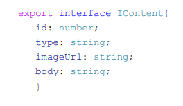

---

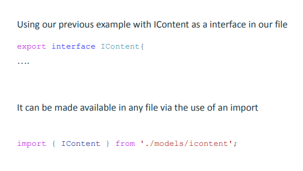

### TypeScript 
--- 
Some Variables can be set as optional 
` body?: string`   
- We can ever set default values by using an = sign 
    `public fName: string = "Luffy";`
### Example : Wish List 
--- 
- Create a class to store WishItem   
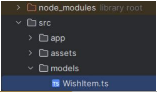
- Add into your WishItem.ts file:   
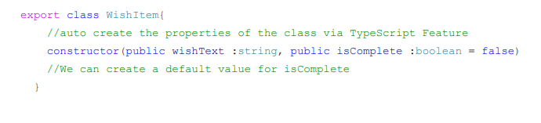
- Go to app.component.ts and import WishItem Class   
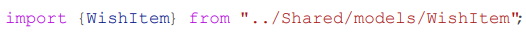
- Add Data:   
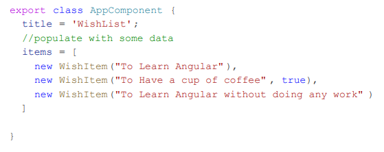
- remove default stuff from app.component.html and add:    
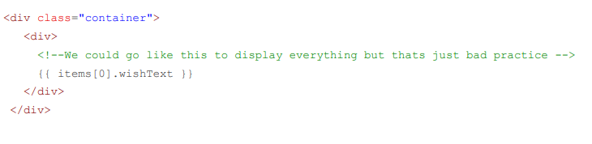
### Looping in Angular 
---
- We are able to use what is called a <strong>directive</strong> inside the html to access a few of our JS loops.
- Traditonally you want to use a for loop `for(let i = 0; i<length; i++)` but that is really needed 
- We can make use of JS `For Of` loop to access each individual element and then iterate over the array until the end 
 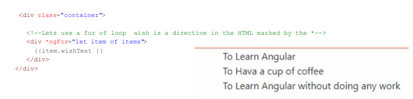
 #### Checkboxs 
 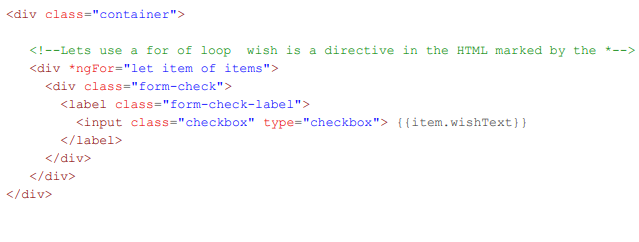

 ### Conditional Logic 
 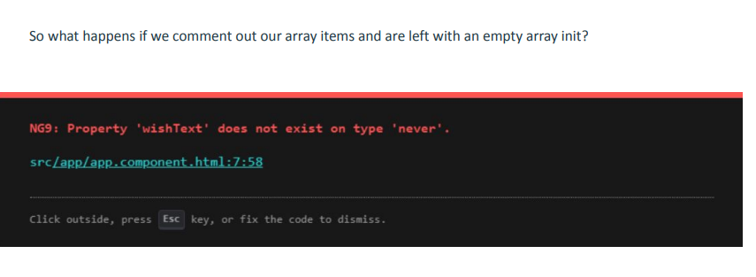
    
#### app.component.ts 
- There is a couple ways to fix this. The Javascript approach would be to make our items array of type any. But, we’re better than Javascript, what would be a better type? 

 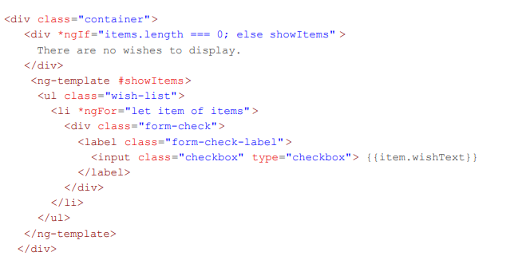

## Week 3 
### What are Components?
---
- a component is a building block of an Angular application 
- It's a TS class with an associated HTML template and styles that define part of the interface 
- Decorated with the `@Component` decorator

- <strong>Why it's important</strong>: Components are responsible for the UI and user interactions 
- Directives and composed of: 
    - HTML View 
    - Specific Stylesheet
    - TS File 

### Key Conecpts : Class 
---
- The component class is written in TS and contains properties and methods that define its behaviour   
    - Properties repersent the state or data   
    - Methods define the functionality and behaviour of the component   

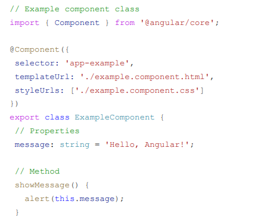
### Key Concepets : Template 
---
- The template is an HTML file associated with the component , which defines how the component should be structured and includes placeholders (bindings) for dynamic data and interactions 
- Angualr uses a special syntax to bind data from the component class to the HTML template   

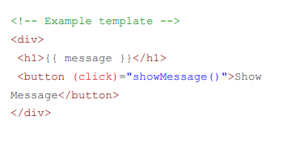

### Key Concpet : Styles
---
- Styles define tje apperance of the component
- can be written in  CSS, SCSS, or anyother  style sheet language supported by Angular  
- Styles are optional, and they help in creating consistent and visually appealing UI
- Style for content in a component should only be defined in the components stylesheet file specifed in the decorator 
    - Styles can be also applied to component tags using the :host CSS Selector  

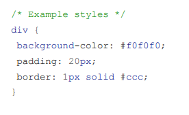

### Key Concept : Meta Data 
---
- The `@Component` decorator is used to associate metadata with the component class 
- In essence, a decorator is a func    

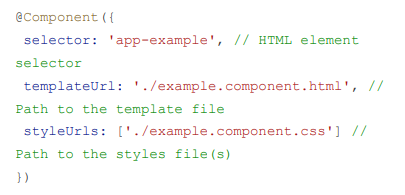

### Key Concept : Selector 
---
 - The `selector` is a CSS selector that defines how the component should be used in the HTML.  `<app-example></app-example>`
 ### Key Concept : Dependency Injection 
 - Angular has a powerful dependency injection system that allows  components to request dependencies from outside services 
 #### Why is it important 
1. Modularity 
2. Reusability 
3. Encapsulation 
4. Maintainability 
5. Consistent UI 

### Getting Started 
---
- create component `ng  generate component ContentCard`
- can also use scripts built into the package.json `npm run-script` `ng generate component ContentCard`

### ngOnInit 
- <i>ngOnInit</i> is a lifecycle hook that is part of the lifecycle events that a component goes through 
- Lifecycle hook sin Angualr provide developers with a way to tap into certain moments in the components life cycle and execute custom logic 
- Developers can use the ngOnInit hook to perform custom initialization logic for the component
- can be: setting up initial values, fetching data from a service, or performing any other necessary setup tasks  
- it is best practice to put initialization loogic that depends onthe components input properties or other setup tasks in the init method  
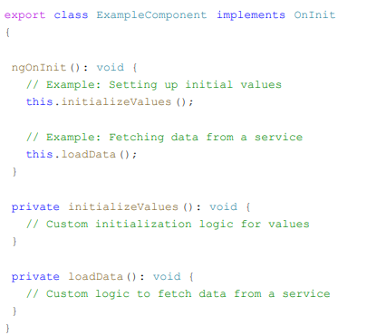

### ngOnInit vs Constructors 
- Constructors get caleed when the class is being instantiated (before ngOnInit)
- ^ used for dependency injections and initializing class properties 
- Angular Lifecycle hooks https://angular.io/guide/lifecycle-hooks
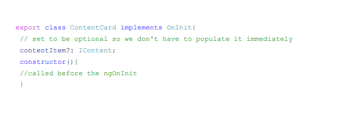
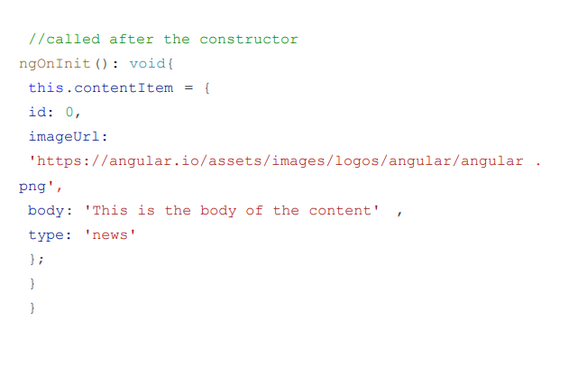

### How About the HTML?
---
- this is one way you can display the contentItem in the ContentCard's HTML file 
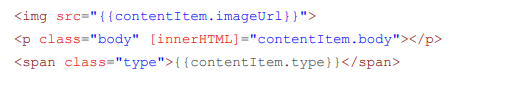

### Passing Data to Components 
--- 
- To pass down from one component to another, we can define input values that a component accepts 

``` 
export class ContentCard implments OnInit{ 
    @Input() contentItem?: IContent; 
    constructor() { } 
}
```
- This allows the ContentCard component to accept contentItem  as a parameter when it is added to the HTML of another component 

#### This means we can move our individual contentItem definition to the AppComponent's TypeScript file
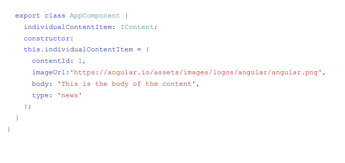
#### And noe our AppComponents HTML can be updated to include a dynamic ContentCard 
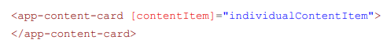

### Additional options when using *ngFor
--- 
- *ngFor can be very versatile and can track many things 
    - the current index of the element 
    - check if its first, last, even and odd 

#### EX. with index and first 
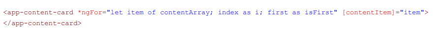

#### Using isFirst 
- We can now use `isFirst` to do things like set the class of an HTML element if its true 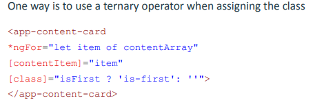

